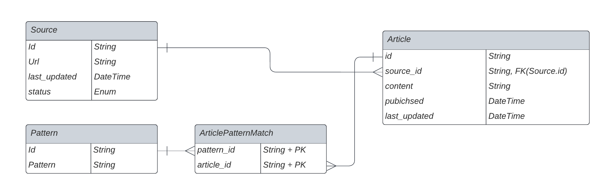

# messari-coding-challenge

Implementation of RSS Feed scraper & REST API for Messari Back End role

### Table of Contents

1. [Quickstart](#quickstart)
2. [Developmemt](#Development)
3. [Technologies Used](#technologies-used)
4. [API Documentation](#api-documentation)
5. [Next Steps](#next-steps-assuming-more-development-time)

# Quickstart

## Install Necessary Software

This project uses [Docker](https://docs.docker.com/get-docker/), it is neccesary to launch and run the system.

### Optional Software

This project includes a [Postman](https://www.postman.com/downloads/) collection to easily make requests to different REST endpoints. This helps save time, makes basic testing easy and makes actions repeatable.

## Environment Variables

We use a `.env` file to inject environment variables into docker containers

In the top level directory, create a .env file and copy the sample vars below. if this were production, we would have multiple environment files e.g. `.env.dev` or `.env.prod`

1. `touch .env`
2. `REDIS_HOST="redis"`  
   `REDIS_PORT=6379`  
   `POSTGRES_CONNECTION_STRING="postgresql+psycopg2://postgres:postgres@db:5432"`

## Start the application

This application is configured to run within a handful of docker containers.

Start it by running  
`docker compose up`

Note: Due to the way that docker-compose depends-on works, which is to only wait for the starting of a service instead of it's start completion, it is possible that the Flask API will retry starting up if the DB is not yet finished booting.

# Development

Note: Copy Environment variables from .vscode/launch.json as they are slightly different than the ones used for Docker.

This repository uses python venv for local development.

Create the virtual environment, activate it and install requirements.

1. `python3 -m venv venv`
2. `. venv/bin/activate`
3. `cd app`
4. `pip3 install -r requirements.txt`

Run the docker containers of neccessary depedencies, alternatively you could run postgres & redis locally.  
`docker compose up redis db`

Run the flask app, I like using the VSCode debugger to do this, but you can also do it in the CLI by running  
`flask --app app.py --debug run`

# Technologies Used

All code in this repository is written in Python3.

1. REST API - Flask
2. Data Storage - PostgresSQL
3. ORM - SqlAlchemy/psycopg2
4. Caching - Redis
5. Streaming - flask-sse
6. Web Server - gunicorn + nginx proxy
7. Web Scraping - feedparser for RSS & beautifulsoup using lxml for HTML

### DB Models

# API Documentation

1. Article Routes
   - /articles retrieves all articles in the DB
   - /article/<article_id> retrieves a single article by URL
   - /articles/pattern retrieves all articles for a pattern_id
2. News Source Routes
   - /source/create creates a new News Source and parses it
   - /sources retrieves all News Sources in the DB
   - /source/<source_id> retrieves a single News Source by ID
   - /source/update/ updates a News Source by ID
   - /source/delete deletes a News Source by ID
3. Pattern Routes
   - /pattern/create creates a new Pattern and looks for new matches
   - /patterns retrieves all patterns in the DB
   - /pattern/<pattern_id> retrieves a single pattern by ID
   - /pattern/article/ retrieves all article that match Pattern
   - /pattern/update/ updates a pattern and reprocesses it
   - /pattern/delete deletes a pattern and any pattern matches associated
4. ETL Routes
   - /feed/run_etl runs the ETL feed -- used by a shell script to periodically run the feed. This implementation is not ideal and was chosen in the interest of simplicity and time. See notes below for more detail
     - Ideally this feed would be triggered without interacting with the Flask API whatsoever, instead managed by a workflow orchestrater like Apache Airflow.
     - Benefits of this approach would include more robust re-try mechanisms, job tracking and a seperation of the ETL feed from the REST API in the event the API ever went down, the feed would be unaffected.
5. Streaming Routes
   - /stream/subscribe?channel=<pattern_id|news_source_id> creates an SSE subscription channel for the specified pattern or news_source
     - I chose SSE over WebSockets because theres no need for subscribers to communicate with the Rest API other than subscription initiation

# Next Steps assuming more development time

1. Add CI/CD pipeline
2. Use Workflow Orchestration for managing ETL feed
3. Increasing performance/scale
   - multi-threading server requests to increase API throughput
   - Database replication & sharding
   - Horizontally scale web crawling processes & API
4. Collect analytics on article processing/querying
5. Enhance streaming capabilities to support more combinations of Patterns/New Sources
6. Add Server Side rendering for raw HTML to ensure we are appropriately parsing dynamic content
7. Support for more types of pattern matching & querying
